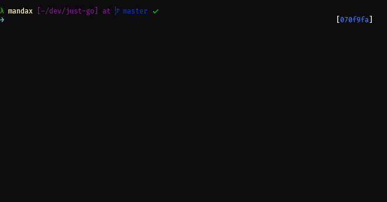

# Just Go

Just Go is an early stage platform to manage restaurants.

## Repo

This project uses a Monorepo structure managed with Lerna.js. Each part of the project is a different package:

- server - Rest Api Server
- api - Frontend services
- ui - Ui Components
- manager-pos - Restaurant Manager and Point of Sale app

## Dependencies

- Ruby 2.5.6
- Rails 6
- Postgresql 10+
- Nodejs 10.x+
- Npm/Npx 6.x+

## Running

Each package has your own running pipeline, but with Lerna it's possible to execute all at once. You don't need to install lerna globally, but it will be faster if you do.

    npm install lerna -g

### Install dependencies

Assuming that the project dependencies are installed, this command will install and configure all package dependencies, also Lerna will link local packages. The first run can take a while.

    npm run bootstrap

You can also run separately, if you want:

    # for frontend dependencies
    npm run bootstrap:front 
    
    # for rails bundler
    npm run bootrstrap:server
    
    # to purge, migrate and seed the database
    npm run bootstrap:db

### Start the project

To run the project and start developing, just type:

    npm start

- Server http://localhost:3000
- Manager and POS http://localhost:8080
- Ui Storybook http://localhost:8081

You can also run separately each package:

    # to run the server
    npm run server

    # to run the manager-pos
    npm run manager

    # this will run the ui Storybook
    npm run ui

### Running tests

To run the all tests you can type:

    npm run test

You can also enter the package and run each project test with the same command.

## TODO

- [ ]  storage fonts locally on ui package
- [ ]  change images based on unsplash api
- [x]  migrate item->dish
- [ ]  add preloader steps
- [ ]  add API URL to environment var
- [ ]  add DB config to environment var
- [x]  add select input component
- [ ]  add form validation
- [x]  create new dish
- [ ]  add unit tests for ui components
- [ ]  add search bar on dishes
- [ ]  user authentication - server
- [ ]  add login page
- [ ]  add sign in page
- [ ]  setup a docker-compose to run the project
- [ ]  add production build and deploy
- [x]  add ui interactive docs